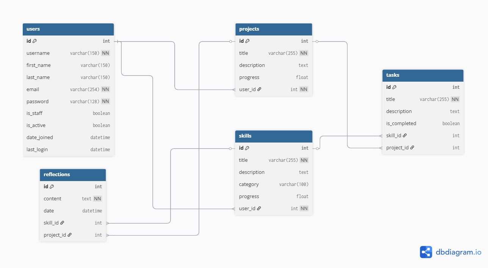

# Capstone-Project
# SkillHub – Skills & Projects Tracker

## Table of Contents
1. [Project Description](#project-description)
2. [Tech Stack](#tech-stack)
3. [User Stories](#user-stories)
4. [Entity Relationship Diagram (ERD)](#entity-relationship-diagram-erd)
5. [Installation Guide](#installation-guide)
6. [Key Features Implemented](#key-features-implemented)
7. [Challenges Encountered & Solutions](#challenges-encountered--solutions)
8. [Future Enhancements](#future-enhancements)
---

## Project Description

**Overview:**  
SkillHub is a comprehensive Django-powered personal development web application designed to help users systematically track and manage their learning journey. The platform enables users to organize their growth through **skills development** and **project management**, providing a structured approach to personal and professional advancement.

**Core Philosophy:**  
SkillHub addresses the common challenge of maintaining momentum in personal development by providing a centralized platform where users can break down their aspirations into manageable, trackable components. By combining task management with reflective learning practices, the application promotes both achievement and self-awareness.

**Target Audience:**  
- Students seeking to organize their learning objectives
- Professionals developing new competencies
- Lifelong learners tracking multiple skill areas
- Project managers organizing personal initiatives
- Anyone committed to structured personal growth

**Key Features:**  
- **Comprehensive User Management:** Secure authentication with profile customization
- **Skills Tracking:** Categorized skill development with progress monitoring  
- **Project Management:** Full-featured project organization with task breakdown
- **Task System:** Granular task management with completion tracking
- **Reflective Learning:** Timestamped notes and reflections for continuous improvement
- **Progress Analytics:** Real-time progress visualization and statistics
- **Responsive Design:** Mobile-first approach ensuring accessibility across devices
- **User Experience:** Professional interface with intuitive navigation and clear feedback  

---

## Tech Stack
- **Backend:** Django (Python)  
- **Frontend:** HTML, CSS, Django Template Language (DTL)  
- **Database:** SQLite  
- **Version Control:** Git & GitHub  

---

## User Stories

### Authentication & Account Management
1. As a user, I want to register an account with my full name and email, so I can save my skills and projects privately.  
2. As a user, I want to log in and log out securely, so my data remains protected.
3. As a user, I want to see error messages when login fails, so I know what went wrong.
4. As a user, I want to view my profile information, so I can see my account details.
5. As a user, I want to edit my profile (username, email, names), so I can keep my information current.
6. As a user, I want to change my password securely, so I can maintain account security.
7. As a user, I want to delete my account permanently, so I can remove all my data if needed.
8. As a user, I want password visibility toggles on forms, so I can verify what I'm typing.  

### Skills Management
9. As a user, I want to add new skills with title, description, and category, so I can track my learning goals.  
10. As a user, I want to view individual skill details, so I can see all related tasks and reflections.
11. As a user, I want to update skill details, so I can adjust descriptions or categories.  
12. As a user, I want to delete skills safely, so I can remove outdated goals.  
13. As a user, I want to view all my skills with automatic progress indicators, so I can track my achievements at a glance.  

### Projects Management
14. As a user, I want to add projects with title and description, so I can track personal or work-related projects.  
15. As a user, I want to view individual project details, so I can see all related tasks and reflections.
16. As a user, I want to update project details, so I can manage them effectively.  
17. As a user, I want to delete projects safely, so I can remove completed or canceled ones.  
18. As a user, I want to view all my projects with automatic progress bars, so I can easily see progress.  

### Tasks Management
19. As a user, I want to add tasks to a specific skill with title and description, so I can break learning goals into actionable steps.  
20. As a user, I want to add tasks to a specific project with title and description, so I can organize project work.
21. As a user, I want to toggle tasks as completed/incomplete, so I can track my progress easily.  
22. As a user, I want to edit task details, so I can update or clarify task requirements.
23. As a user, I want to delete tasks safely, so I can remove unnecessary or completed items.  
24. As a user, I want progress bars to automatically update when I complete tasks, so I can monitor overall progress in real-time.  

### Reflections & Notes
25. As a user, I want to add timestamped reflections to skills, so I can track my learning experience and thoughts.  
26. As a user, I want to add timestamped reflections to projects, so I can document my project journey.
27. As a user, I want to view all reflections for a skill/project chronologically, so I can reflect on my growth over time.  
28. As a user, I want to edit my reflections, so I can update or clarify my thoughts.
29. As a user, I want to delete reflections safely, so I can remove outdated or incorrect notes.  

### Dashboard & Analytics
30. As a user, I want to see a personalized welcome message with my name, so I feel recognized.
31. As a user, I want to view my overall statistics dashboard, so I can see total skills, projects, and tasks at a glance.
32. As a user, I want to see separate progress analytics for skills and projects, so I can understand my performance in different areas.
33. As a user, I want to see task completion statistics, so I can monitor my productivity.
34. As a user, I want quick action buttons on the homepage, so I can rapidly create new skills or projects.

### Data Management
35. As a user, I want sample data automatically created when I register, so I can understand how the app works immediately.
36. As a user, I want to clear all sample data easily, so I can start fresh with my own content.

### User Experience & Navigation
37. As a user, I want responsive mobile navigation with a hamburger menu, so I can use the app effectively on my phone.
38. As a user, I want clear success and error messages for all actions, so I know when operations succeed or fail.
39. As a user, I want confirmation dialogs before deleting important data, so I don't accidentally lose information.
40. As a user, I want a professional, consistent visual design, so the app looks trustworthy and modern.

### Stretch / Future Features
41. As a user, I want to visualize my progress across all skills/projects with charts.  
42. As a user, I want to filter skills/projects by category or priority.  
43. As a user, I want to upload files or images related to skills/projects.  

---
## Entity Relationship Diagram (ERD)



---

## Installation Guide

### Prerequisites
- Python 3.8+ (Project developed with Python 3.13)
- pip (Python package manager)
- Git (for cloning the repository)

### Setup Steps
1. **Clone the repository:**
   ```bash
   git clone https://github.com/hayat-hani/Capstone-Project
   cd Capstone-Project
   ```

2. **Create and activate virtual environment:**
   ```bash
   python -m venv venv
   
   # On macOS/Linux:
   source venv/bin/activate
   
   # On Windows:
   venv\Scripts\activate
   ```

3. **Install dependencies:**
   ```bash
   # Method 1: Using Pipfile (recommended)
   pip install pipenv
   pipenv install
   pipenv shell
   
   # Method 2: Direct installation
   pip install django==5.2.7 psycopg2-binary
   ```

4. **Run migrations:**
   ```bash
   python manage.py migrate
   ```

5. **Create superuser (optional):**
   ```bash
   python manage.py createsuperuser
   ```

6. **Start development server:**
   ```bash
   python manage.py runserver
   ```

7. **Visit the application:**
   Open your browser to `http://127.0.0.1:8000`

### First Time Setup
- Upon registration, sample data will be automatically created to help you understand the app features
- You can clear sample data from your profile menu when ready to add your own content
- The app includes comprehensive user tutorials through the sample data

### Troubleshooting
- **Migration errors:** Ensure you're in the project directory and virtual environment is activated
- **Port conflicts:** If port 8000 is busy, use `python manage.py runserver 8080`
- **Dependencies issues:** Try `pip install --upgrade django` if you encounter version conflicts

---

## Key Features Implemented

### Authentication & User Management
- User registration with custom form (first name, last name, email)
- Login/logout functionality with error handling
- Password change with current password verification
- Account deletion with data cleanup
- Profile editing capabilities
- Password visibility toggles on all forms

### Skills Management
- Create, read, update, delete skills
- Automatic progress calculation based on task completion
- Category organization
- Individual skill detail pages with tasks and reflections

### Projects Management
- Full CRUD operations for projects
- Task-based progress tracking
- Project detail views with comprehensive information
- Progress visualization with dynamic bars

### Tasks System
- Add tasks to skills or projects
- Toggle task completion status
- Edit and delete tasks
- Automatic parent progress updates

### Reflections & Notes
- Add timestamped reflections to skills and projects
- Edit and delete reflections
- Track learning journey and thoughts

### User Experience
- Responsive mobile-first design
- Professional styling with CSS design system
- Intuitive navigation with mobile hamburger menu
- Sample data auto-generation for new users
- Clear feedback messages for all actions

---

## Challenges Encountered & Solutions

### 1. **Foreign Key Constraint Issue**
**Challenge:** Account deletion failed due to phantom UserProfile table constraint.
**Solution:** Implemented try-catch error handling with manual cleanup of related records before user deletion.

### 2. **Progress Calculation Logic**
**Challenge:** Ensuring progress bars update automatically when tasks are completed.
**Solution:** Implemented custom save methods in Task model to trigger parent (Skill/Project) progress recalculation.

### 3. **Mobile Responsive Navigation**
**Challenge:** Creating a professional mobile navigation without CSS frameworks.
**Solution:** Built custom hamburger menu with CSS transforms and JavaScript toggle functionality.

### 4. **Performance & Code Organization**
**Challenge:** CSS duplication, overly specific selectors, and no systematic approach to styling.
**Solution:** Organized CSS with proper specificity hierarchy, eliminated duplication, and implemented maintainable code structure.

### 5. **Typography Hierarchy Inconsistency**
**Challenge:** Inconsistent font sizes, weights, and poor visual hierarchy across different pages and components.
**Solution:** Established consistent typography scale with proper heading hierarchy (h1: 2.5rem, h2: 2rem, etc.) and standardized font weights.

---

## Future Enhancements

### Potential Features
- **Data Visualization:** Charts and graphs for progress analytics
- **File Uploads:** Attach documents or images to skills/projects
- **Goal Setting:** Set target completion dates and deadlines
- **Export Features:** Generate PDF reports or CSV data exports
- **Collaboration:** Share skills/projects with other users
- **Notifications:** Email reminders for pending tasks

### Technical Improvements
- **Unit Testing:** Comprehensive test coverage for all features
- **API Development:** REST API for mobile app integration
- **Caching:** Redis implementation for improved performance
- **Advanced Security:** Two-factor authentication, rate limiting
